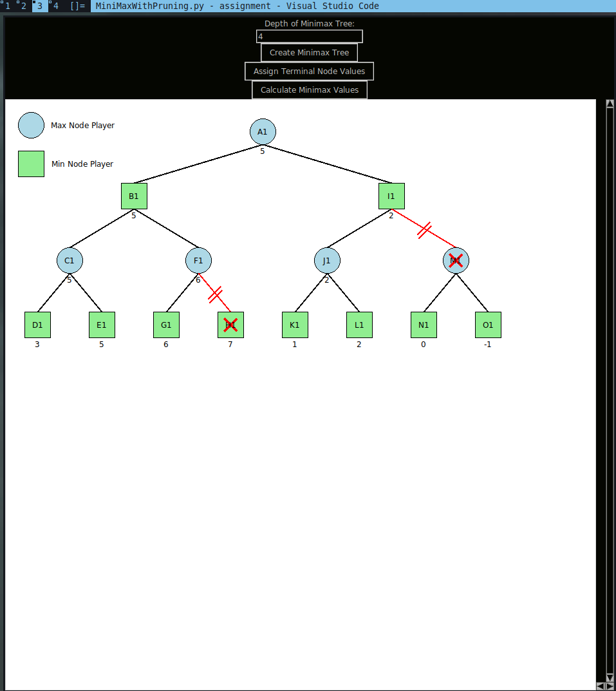

# MiniMax with Alpha Beta Pruning Visualizer

- This demo image was captured on linux running python 3.11 running `MiniMaxWithPruning` file.

  

## Implementation Details

- The Minimax Tree Visualizer is implemented using the following classes and methods:
  - `Node` class: This class represents a node in the Minimax Tree. It has the following attributes:
    - `label`: A unique label for the node.
    - `value`: The value of the node (None for non-terminal nodes).
    - `is_max`: A boolean value indicating whether the node is a max node or a min node.
    - `children`: A list of child nodes.
    - `coords`: The coordinates of the node in the canvas.
  - `MinimaxTreeVisualizer` class: This class represents the main application window. It has the following attributes:
    - `root`: The root window of the application.
    - `canvas_width`: The width of the canvas.
    - `canvas_height`: The height of the canvas.
    - `total_nodes`: The total number of nodes in the tree.
    - `nodes`: A list of all nodes in the tree.
    - `depth_label`, `depth_entry`: Label and entry for inputting the depth of the Minimax Tree.
    - `create_tree_button`, `assign_values_button`, `calculate_minimax_button`: Buttons for creating the tree, assigning terminal node values, and calculating Minimax values.
    - `canvas_frame`: The frame for the canvas.
    - `canvas`: The canvas for drawing the tree.
    - `x_scrollbar`, `y_scrollbar`: Scrollbars for the canvas.

  - Implementation details for the methods in the `MinimaxTreeVisualizer` class are given below:

    - `__init__(self, root)`: This is the constructor method for the `MinimaxTreeVisualizer` class. It initializes the root window, canvas dimensions, total nodes, nodes list, and all the GUI components (labels, entries, buttons, canvas, scrollbars).

    - `draw_initial_symbols(self)`: This method draws the initial symbols (a light blue circle for the max node player and a light green rectangle for the min node player) on the canvas.

    - `create_tree(self)`: This method deletes all existing items from the canvas, draws the initial symbols, resets the total nodes and nodes list, and draws the tree based on the depth entered by the user.

    - `draw_tree(self, depth, x, y, delta_x, is_max=True)`: This method is a recursive function that draws the tree on the canvas. It creates a new node, adds it to the nodes list, and draws the node on the canvas. If the depth is greater than 1, it recursively calls itself to draw the child nodes.

    - `prompt_terminal_node_values(self)`: This method prompts the user to enter the values for the terminal nodes. It then computes the minimax values and redraws the tree with the minimax values.

    - `calculate_minimax_values(self)`: This method computes the minimax values and redraws the tree with the minimax values.

    - `compute_minimax_values_recursively(self, node, alpha=float('-inf'), beta=float('inf'))`: This method is a recursive function that computes the minimax values for the nodes. It uses the Alpha-Beta Pruning technique to prune the branches that do not need to be explored.

    - `redraw_tree_with_minimax(self, pruned_nodes)`: This method redraws the tree with the minimax values. It also highlights the pruned branches in red.

    - `get_unique_label(self)`: This method generates a unique label for each node. The label is a combination of a letter (from A to Z) and a number. The number is incremented each time the letter reaches Z.

        The `main()` function creates an instance of the `MinimaxTreeVisualizer` class and starts the Tkinter main loop.

## Challenges Faced

1. Understanding the concept of Minimax Algorithm
2. Implementing the Minimax Algorithm
3. Creating a visual representation of the Minimax Tree
4. Implementing the Alpha-Beta Pruning
5. Creating a visual representation of the pruned Minimax Tree
6. Integrating the Minimax Algorithm with the visual representation of the Minimax Tree
7. Integrating the Alpha-Beta Pruning with the visual representation of the pruned Minimax Tree
8. Creating a user interface for the Minimax Tree Visualizer
9. Handling user input for terminal node values
10. Generating unique labels for nodes
11. Adjusting the canvas size based on the depth of the tree
12. Drawing the tree recursively based on the depth and node type (max or min)
13. Redrawing the tree with Minimax values and pruned branches after calculation
14. Handling exceptions for invalid user input

## Additional Features

1. The user can input the depth of the Minimax Tree, and the canvas size will adjust accordingly.
2. User input is being validated so that only numbers are accepted for terminal node values.
3. The pruned branches are highlighted in red to distinguish them from the unpruned branches.
4. At last, there is a functional scrollbar for the canvas.

## Lessons Learnt

1. GUI is not that hard.
2. Generating dynamic tree structure and then visualizing the nodes, their edges, their labels, assigning values to the nodes, and then calculating the Minimax values was a bit challenging.
3. Traversing the tree to identify terminal nodes and prompting the user for their values was a significant challenge.
4. Minimax with Pruning is not that hard anymore.
